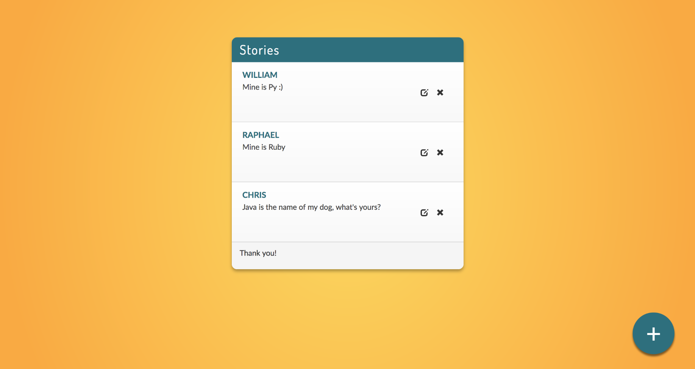

# Progressive Serverless MERN Web App

The application follows the **PWA standards** (manifest file, service worker) and the front-end is build with **React**.

The server code, instead of running in local or on the server's app, run on the oAuth servers and is deployed using the **Webtask Tool package**.

